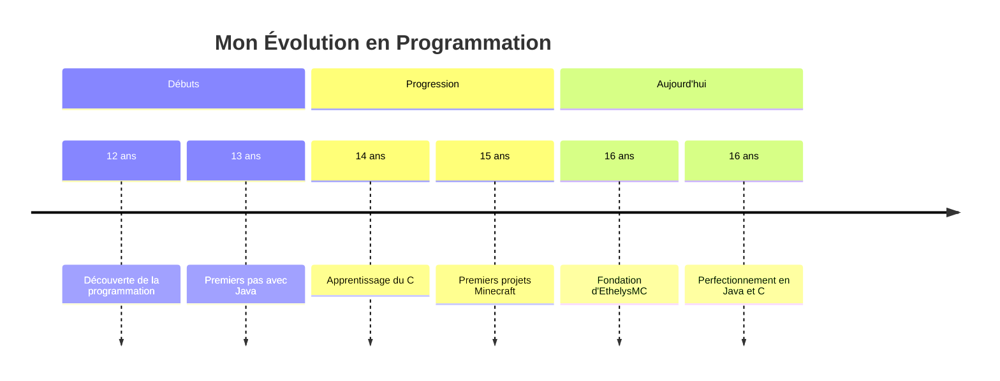

<h1 align="center">
  
</h1>

<p align="center">
  
</p>

<div align="center">
  
  
  
</div>

<br>

<div align="center">
  
  
</div>

## 💫 À propos de moi

<div align="center">
  
</div>

```javascript
const remi = {
  age: 16,
  location: "Nord de la France",
  languages: ["Java", "C"],
  projects: ["Ethelys", "TraficLillois],
  passions: ["Spigot", "Transports"],
  motto: "Codeur le jour, gamer la nuit",
};
```

Salut ! Je suis **Rémi**, jeune développeur passionné de 16 ans originaire du Nord de la France. Je me spécialise en **Java** et **C**, des langages que j'utilise pour donner vie à mes idées les plus créatives !

<br>

## 🌟 Mon Projet Principal

<div align="center">
  <a href="https://www.ethelysmc.com">
    
  </a>
</div>

<p align="center">
  
</p>

<details>
  <summary><b>🎮 Découvrir EthelysMC</b></summary>
  
  <br>
  
  <div align="center">
    
  </div>
  
  ### 🚀 Vision
  EthelysMC est né de ma passion pour Minecraft et la programmation. Mon objectif ? Créer un serveur unique qui offre une expérience de jeu innovante et immersive.
  
  ### 🛠️ Développement
  - Plugins personnalisés en Java
  - Architecture optimisée pour les performances
  - Systèmes de jeu uniques
  - Communauté au cœur du projet
  
  ### 🔮 Futur
  Malgré plusieurs projets abandonnés par le passé, je reste déterminé à faire d'EthelysMC un succès. Chaque erreur m'a permis d'apprendre et de revenir plus fort !
</details>

## 🧰 Mes Compétences

<div align="center">
  
  
  
  
  
  
</div>

<div align="center">
  
</div>

## 📈 Mon Parcours



## 🎯 Mes Objectifs

<div align="center">
  
</div>

| Court Terme | Moyen Terme | Long Terme |
|-------------|-------------|------------|
| Perfectionner mes skills en Java | Développer EthelysMC | Devenir développeur professionnel |
| Apprendre de nouveaux langages | Créer une communauté | Lancer d'autres projets |
| Contribuer à des projets open source | Maîtriser le développement de plugins | Inspirer d'autres jeunes développeurs |

## 📫 Comment me contacter

<div align="center">
  
  <a href="https://discord.gg/ethelysmc">
    
  </a>
  <a href="https://www.ethelysmc.com">
    
  </a>
  <a href="https://github.com/lye-code">
    
  </a>
  
</div>

## ⚡ Fun Facts

<div align="center">
  <table>
    <tr>
      <td>🎮 Codeur le jour, gamer la nuit</td>
      <td>🌍 Nordiste fier de mes racines</td>
    </tr>
    <tr>
      <td>💻 J'ai écrit mon premier code à 12 ans</td>
      <td>🚀 Beaucoup de projets abandonnés, mais j'apprends de chaque échec</td>
    </tr>
  </table>
</div>

---

<div align="center">
  
</div>
